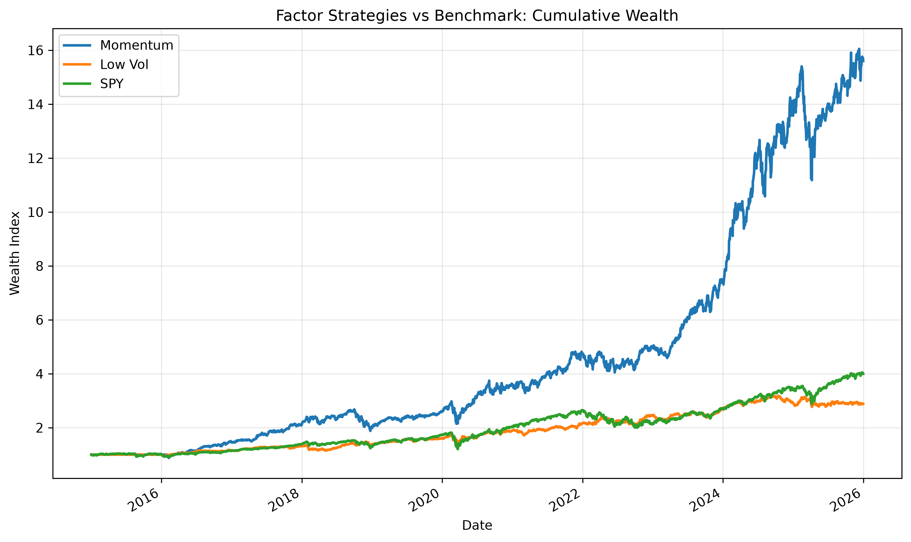
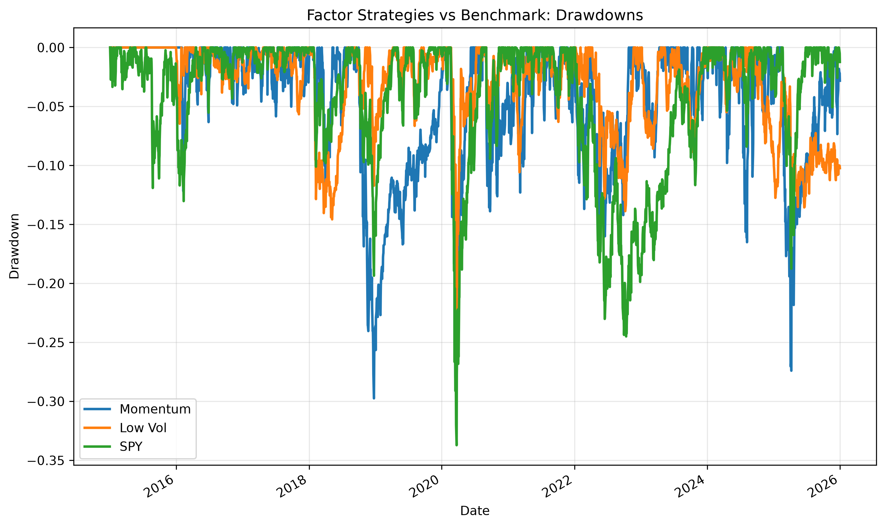
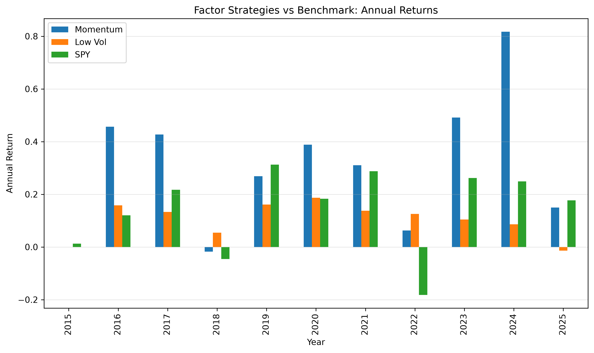

# Factor Investing Backtester

A modular Python backtesting framework for researching systematic equity factor strategies, with implementations of momentum and low-volatility portfolios, benchmark comparison, transaction cost modeling, performance analytics, and professional visualisations.

## Project Overview

This project was built to explore how professional-style quantitative equity research can be structured in Python. The repository implements a reusable research pipeline for:

- downloading and cleaning historical equity price data
- defining an investable universe and eligibility rules
- constructing factor signals
- forming monthly rebalanced portfolios
- backtesting strategies against a benchmark
- evaluating performance with standard risk and return metrics
- generating professional charts and reports

## Factors Implemented

- **Momentum**: trailing return-based ranking using a lookback window and skip period
- **Low Volatility**: trailing rolling volatility ranking using historical daily returns

## Current Features

- Historical adjusted-close equity data pipeline
- Clean separation of raw and processed data
- Dynamic eligibility mask based on minimum history
- Monthly rebalancing framework
- Equal-weight portfolio construction
- Generic backtest engine with one-day weight shift to reduce look-ahead bias
- Benchmark comparison using SPY
- Transaction cost and turnover modeling
- Risk and performance metrics:
  - CAGR
  - annualized return
  - annualized volatility
  - Sharpe ratio
  - Sortino ratio
  - maximum drawdown
- Report-ready plots:
  - cumulative wealth
  - drawdowns
  - annual returns
- Config-driven experiments using YAML
- Unit tests for core backtesting logic

## Repository Structure

```text
factor-backtester/
├── configs/
├── data/
│   ├── raw/
│   ├── processed/
│   └── external/
├── reports/
│   └── figures/
├── scripts/
├── src/
│   └── factor_backtester/
├── tests/
├── README.md
├── requirements.txt
└── pyproject.toml
```

## Methodology

- Universe: liquid large-cap US equities plus SPY as benchmark
- Sample: daily data from 2015 onward
- Rebalancing frequency: monthly
- Portfolio construction: equal-weight selected names
- Momentum portfolio: top-ranked stocks by trailing momentum
- Low-volatility portfolio: bottom-ranked stocks by trailing rolling volatility
- Transaction costs: simple basis-point cost model based on portfolio turnover

## How to Run

```text
.\.venv\Scripts\Activate.ps1
$env:PYTHONPATH="src"
python .\scripts\build_dataset.py
python .\scripts\build_processed_data.py
python .\scripts\build_returns_data.py
python .\scripts\run_momentum_backtest.py
python .\scripts\run_low_vol_backtest.py
python .\scripts\generate_report.py
pytest
```

## Additional Scripts

Cost-adjusted backtests and comparisons:
```text
python .\scripts\run_momentum_backtest_with_costs.py
python .\scripts\run_low_vol_backtest_with_costs.py
python .\scripts\compare_strategies.py
python .\scripts\compare_gross_vs_net.py
```

## Plots

### Cumulative Wealth


### Drawdowns


### Annual Returns
